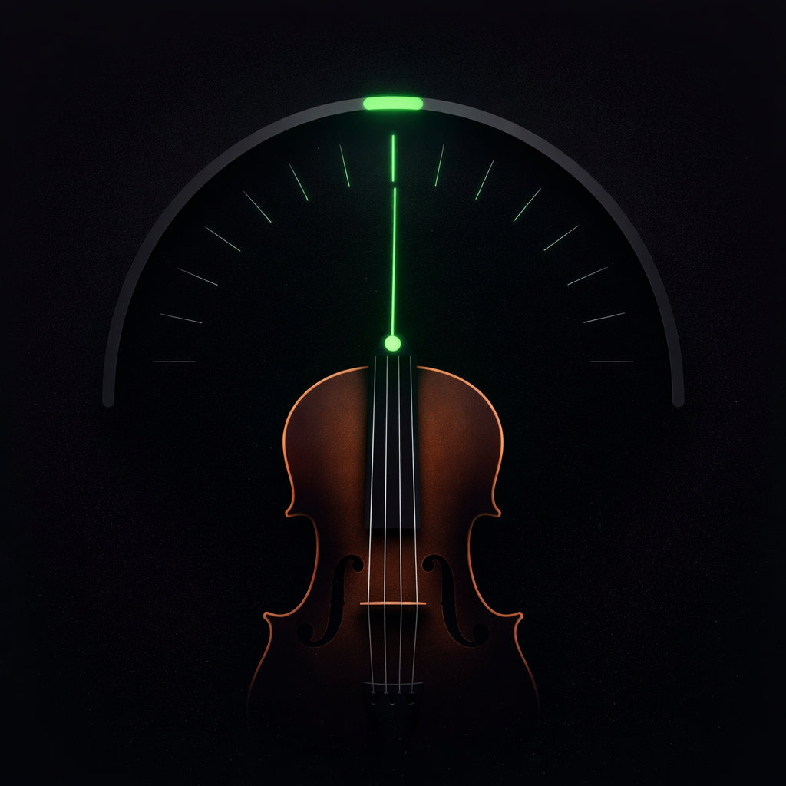

# 🎻 Simple Violin Tuner

A simple, ad-free, open-source violin tuner app for Android.

[](https://opensource.org/licenses/MIT)
[](https://developer.android.com)

## Features

- ✅ **Real-time pitch detection** via microphone
- ✅ **All 4 strings**: G, D, A, E
- ✅ **Customizable frequencies** (440 Hz, 442 Hz, 443 Hz or custom)
- ✅ **Visual gauge display** with animated needle
- ✅ **Cents deviation** for precise tuning
- ✅ **Automatic string detection**
- ✅ **Manual string selection**
- ✅ **Settings are saved** across app restarts
- ✅ **No ads, no trackers**
- ✅ **Works offline**

## Screenshots

<p align="center">
  
</p>

## Download

### Direct APK Download

⬇️ **[Download Latest Release](../../releases/latest)**

### Installation

1. Download the APK file
2. Open it on your Android device
3. Allow "Install from unknown sources" if prompted
4. Install the app
5. Grant microphone permission when asked

## Requirements

- Android 8.0 (API 26) or higher
- Microphone

## Building from Source

### Prerequisites

- Android Studio (latest version)
- JDK 11 or higher

### Build Steps

1. Clone the repository:
   ```bash
   git clone https://github.com/YOUR_USERNAME/simple-violin-tuner.git
   ```

2. Open the project in Android Studio

3. Build the debug APK:
   ```bash
   ./gradlew assembleDebug
   ```

4. The APK will be in `app/build/outputs/apk/debug/app-debug.apk`

## Project Structure

```
app/src/main/java/com/example/simpleviolintunerad_free/
├── audio/
│   ├── AudioRecorder.kt      # Microphone recording
│   ├── FFT.kt                # Fast Fourier Transform
│   ├── PitchDetector.kt      # Frequency detection
│   └── ViolinTunerConfig.kt  # Configuration constants
├── data/
│   └── SettingsRepository.kt # Persistent settings
├── ui/
│   ├── components/
│   │   ├── FrequencySettingsDialog.kt
│   │   ├── StringSelector.kt
│   │   └── TunerDisplay.kt
│   ├── screens/
│   │   └── TunerScreen.kt
│   └── theme/
├── viewmodel/
│   └── TunerViewModel.kt
└── MainActivity.kt
```

## Technical Details

### Pitch Detection

The app uses a custom FFT (Fast Fourier Transform) implementation to analyze audio frequencies in real-time. No external audio processing libraries are used, ensuring long-term stability and minimal dependencies.

### Standard Frequencies

| String | Frequency |
|--------|-----------|
| G3     | 196.00 Hz |
| D4     | 293.66 Hz |
| A4     | 440.00 Hz |
| E5     | 659.26 Hz |

Users can customize these frequencies for orchestras using different concert pitches (e.g., A = 442 Hz or 443 Hz).

## Privacy

- 🔒 **No data collection** - The app doesn't collect any personal data
- 🔒 **No network access** - The app works completely offline
- 🔒 **Microphone only for tuning** - Audio is processed locally and never stored or transmitted

## Contributing

Contributions are welcome! Please feel free to submit a Pull Request.

1. Fork the repository
2. Create your feature branch (`git checkout -b feature/AmazingFeature`)
3. Commit your changes (`git commit -m 'Add some AmazingFeature'`)
4. Push to the branch (`git push origin feature/AmazingFeature`)
5. Open a Pull Request

## License

This project is licensed under the MIT License - see the [LICENSE](LICENSE) file for details.

## Acknowledgments

- Built with Jetpack Compose
- Material Design 3

---

Made with ❤️ for musicians
